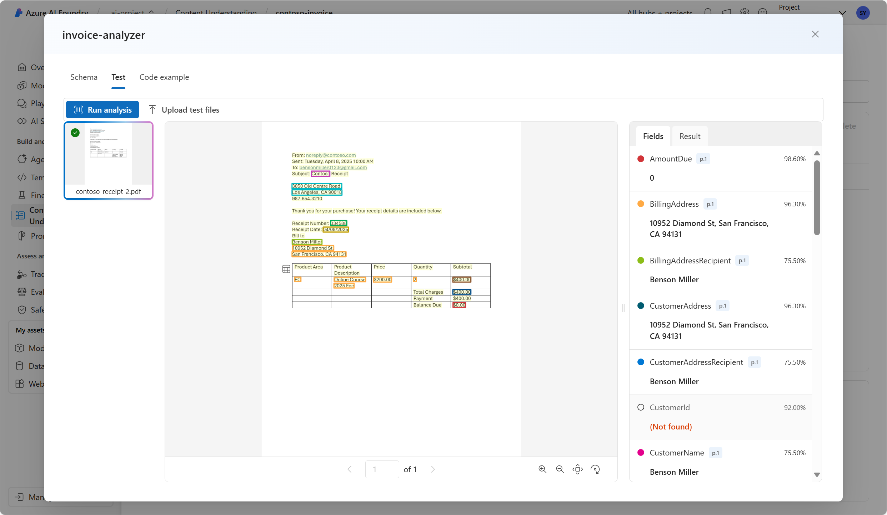

---
lab:
  title: Mengekstrak data dengan Pemahaman Konten di portal Azure AI Foundry
---

# Mengekstrak data dengan Pemahaman Konten di portal Azure AI Foundry

**Pemahaman Konten Azure AI (pratinjau)** menggunakan AI generatif untuk memproses konten dari berbagai jenis (dokumen, gambar, video, dan audio) menjadi format output yang ditentukan pengguna.

Dalam latihan ini, Anda akan menggunakan Pemahaman Konten Azure AI di portal Azure AI Foundry, platform Microsoft untuk membuat aplikasi cerdas, untuk mengenali data dari faktur. 

Latihan ini membutuhkan waktu sekitar **25** menit.

## Membuat proyek Azure OpenAI

Mari kita mulai dengan membuat proyek Azure AI Foundry.

1. Di browser web, buka [portal Azure AI Foundry](https://ai.azure.com) di `https://ai.azure.com` dan masuk menggunakan kredensial Azure Anda. Tutup semua tips atau panel mulai cepat yang terbuka saat pertama kali Anda masuk, dan jika perlu, gunakan logo **Azure AI Foundry** di kiri atas untuk menavigasi ke beranda, yang tampilannya mirip dengan gambar berikut (tutup panel **Bantuan** jika terbuka):

    

1. Di beranda, pilih **+ Buat proyek**.

1. Di wizard **Buat proyek**, masukkan nama yang valid untuk proyek Anda dan jika hub yang telah ada disarankan, pilih opsi untuk membuat yang baru. Kemudian tinjau sumber daya Azure yang akan dibuat secara otomatis untuk mendukung hub dan proyek Anda.

1. Pilih **Kustomisasi** dan tentukan pengaturan berikut untuk hub Anda:
    - **Nama hub** : *Nama yang valid untuk hub Anda*
    - **Langganan**: *Langganan Azure Anda*
    - **Grup sumber daya**: *Buat atau pilih grup sumber daya*
    - **Lokasi:** US Barat 
    - **Menyambungkan Layanan Azure AI atau Azure OpenAI**: *Membuat sumber daya Layanan AI baru*
    - **Menyambungkan Azure AI Search**: Lewati koneksi

1. Pilih **Berikutnya** dan tinjau konfigurasi Anda. Lalu pilih **Buat** dan tunggu hingga prosesnya selesai.

1. Saat proyek Anda dibuat, tutup tips apa pun yang ditampilkan dan tinjau halaman proyek di portal Azure AI Foundry, yang akan terlihat mirip dengan gambar berikut:

    
 
1. Navigasi ke menu di sebelah kiri layar. Kemudian, pilih **AI Services**.

1. Pada halaman *AI Services*, pilih petak *Content Understanding* untuk mencoba kemampuan Pemahaman Konten Azure AI.

## Menganalisis faktur dengan Pemahaman Konten Azure AI di Azure AI Foundry 

Misalkan Anda ingin mengekstrak data dari banyak faktur dan memasukkan data ke dalam database. Anda dapat menggunakan Pemahaman Konten Azure AI untuk menganalisis satu faktur dan membuat penganalisis Anda sendiri yang dapat menganalisis faktur serupa lainnya. Mari kita mulai dengan membuat tugas pemahaman konten.

1. Pilih **Custom analyzer**. 

1. Pilih **+ Create** dan gunakan pengaturan berikut untuk membuat tugas pemahaman konten:
    - **Nama tugas**: contoso-invoice
    - **Deskripsi**: Tugas analisis faktur
    - **Koneksi layanan AI Azure**: *Gunakan default*
    - **Akun Azure Blob Storage**: *Gunakan default*

1. Pilih **Create**, dan tunggu tugas Anda dibuat. 
1. Pilih tugas **contoso-invoice** Anda. 

#### Tentukan skema Anda 

1. Pada halaman *Define Schema* , Anda dapat menambahkan file uji. Unduh [contoso-invoice-1.pdf](https://raw.githubusercontent.com/MicrosoftLearning/mslearn-ai-fundamentals/refs/heads/main/contoso-invoice-1.pdf) dari `https://raw.githubusercontent.com/MicrosoftLearning/mslearn-ai-fundamentals/refs/heads/main/data/contoso-invoice-1.pdf`. 

1. Unggah file ke halaman *define schema*. Pilih templat *Invoice analysis*. Templat faktur memiliki bidang data yang telah dipilih sebelumnya yang akan coba dideteksi oleh penganalisis. 

    

1. Pilih **Buat**. Sekarang Anda memiliki kemampuan untuk mengubah skema dengan menambahkan atau menghapus bidang. Setelah selesai meninjau bidang, pilih **Save**.

    

1. Tunggu analisisnya berjalan. Ini mungkin memerlukan waktu beberapa saat.

#### Uji Penganalis 

1. Setelah analisis selesai, Anda dapat melihat bagaimana kinerja penganalisis di halaman *Test Analyzer* . Tinjau tab *Fields* . Apakah data ini telah sesuai dengan yang ada di faktur? 
    

1. Perhatikan *skor keyakinan* di samping setiap bidang. Skor keyakinan menunjukkan seberapa yakin model tersebut memiliki hasil yang akurat. Hasil dengan skor keyakinan yang mendekati 100% menunjukkan keyakinan yang lebih besar dalam prediksi.
1. Tinjau tab *Results*. Informasi yang sama yang Anda lihat dirender di tab bidang, ada di tab hasil dalam format JSON. JSON menunjukkan bagaimana tampilan informasi saat dikirim ke dan dari aplikasi klien. 

    

1. Layanan Pemahaman Konten seharusnya telah mengidentifikasi dengan benar teks yang sesuai dengan bidang dalam skema. Jika belum melakukannya, Anda dapat menggunakan halaman *Data label* untuk mengunggah formulir sampel lain dan secara eksplisit mengidentifikasi teks yang benar untuk setiap bidang. Ketika Anda puas dengan kemampuan penganalisis dalam mendeteksi data dalam faktur, pilih tab **Build Analyzer** . 

#### Membuat penganalisis Anda 

Sekarang, setelah Anda melatih model untuk mengekstrak bidang dari contoh faktur, Anda dapat membuat penganalisis untuk digunakan dengan formulir serupa. Dengan membuat penganalisis, Anda dapat menyebarkan model dan menggunakannya untuk mengotomatiskan tugas faktur lainnya.

1. Di tab *Build Analyzer*, pilih **+ Build Analyzer**. Masukkan yang berikut: 
    - **Nama**: invoice-analyzer
    - **Deskripsi**: Penganalisis faktur

    

1. Pilih **Kompilasi**. Tunggu hingga penganalisis baru siap (gunakan tombol Refresh untuk memeriksa). Penganalisis Anda menggunakan model prediktif yang didasarkan pada skema yang telah Anda tentukan dan mengujinya di langkah-langkah sebelumnya. 
1. Sekarang mari kita coba menguji penganalisis yang Anda buat. Unduh faktur yang berbeda dari Contoso [contoso-invoice-2.pdf](https://raw.githubusercontent.com/MicrosoftLearning/mslearn-ai-fundamentals/refs/heads/main/data/contoso-invoice-2.pdf) dari `https://raw.githubusercontent.com/MicrosoftLearning/mslearn-ai-fundamentals/refs/heads/main/data/contoso-invoice-2.pdf`.
1. Kembali ke halaman *Build analyzer* dan pilih tautan penganalisis faktur. Bidang yang ditentukan dalam skema penganalisis akan ditampilkan.
1. Di halaman invoice-analyzer, pilih *Test*.
1. Gunakan tombol **+ Upload test files** untuk mengunggah *contoso-receipt-2.pdf*. Pilih **Run analysis** untuk mengekstrak data bidang dari formulir pengujian. Tinjau hasil dari pengujian.

    

1. Pilih tab *Code example*. Cari *endpoint* dalam kode. Dalam fase *Build analyzer* dalam proses ini, Anda menyebarkan model pemahaman konten ke titik akhir. Titik akhir dapat digunakan dalam kode yang mirip dengan apa yang Anda lihat dalam contoh untuk menggabungkan model ke dalam proses yang dapat diulang dalam aplikasi.  

    

## Penghapusan

Jika Anda sudah selesai bekerja dengan layanan Pemahaman Konten, Anda harus menghapus sumber daya yang telah Anda buat dalam latihan ini untuk menghindari timbulnya biaya Azure yang tidak perlu.

- Di portal Azure AI Foundry, navigasikan ke proyek contoso-receipt, lalu hapus.
- Di portal Azure, hapus grup sumber daya yang Anda buat dalam latihan ini.