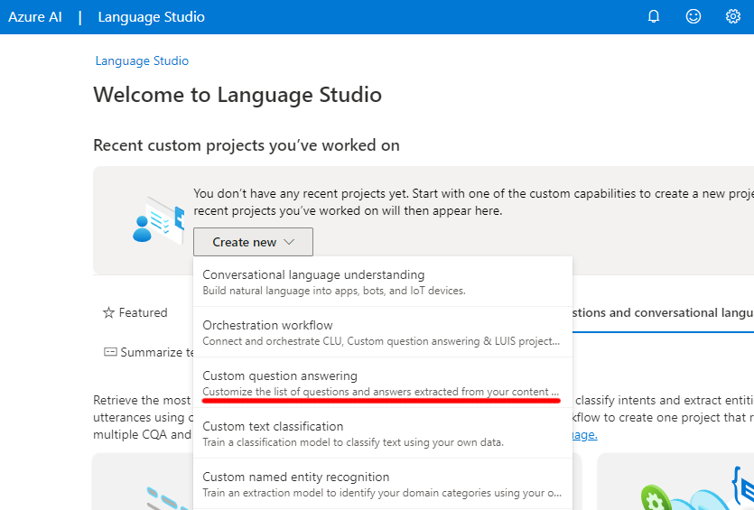

---
lab:
  title: Menggunakan Jawaban atas Pertanyaan dengan Language Studio
---

# Menggunakan model Jawaban Atas Pertanyaan dengan Language Studio

Dalam latihan ini Anda akan menggunakan Language Studio untuk membuat dan melatih basis pengetahuan pertanyaan dan jawaban yang akan digunakan oleh bot layanan pelanggan. Konten untuk basis pengetahuan akan berasal dari halaman FAQ yang ada dari situs web Margie's Travel, agen perjalanan fiktif. Anda kemudian akan menggunakan Language Studio untuk melihat cara kerjanya saat digunakan oleh pelanggan.

Saat menerapkan bot, langkah pertama adalah membuat basis pengetahuan pasangan tanya jawab. Ini digunakan bersama dengan kemampuan pemrosesan bahasa alami bawaan sehingga bot dapat menafsirkan pertanyaan dan menemukan jawaban yang paling tepat untuk pengguna.

Bahasa Azure AI mencakup *kemampuan jawaban atas* pertanyaan, yang akan Anda gunakan untuk membuat basis pengetahuan. Pangkalan pengetahuan dapat dibuat baik dengan memasukkan pasangan pertanyaan dan jawaban secara manual, atau dari dokumen atau halaman web yang ada. Margie's Travel ingin menggunakan dokumen FAQ yang ada.

Fitur jawaban atas pertanyaan layanan Bahasa memungkinkan Anda membuat basis pengetahuan dengan cepat, baik dengan memasukkan pasangan pertanyaan dan jawaban atau dari dokumen atau halaman web yang ada. Layanan ini kemudian dapat menggunakan beberapa kemampuan pemrosesan bahasa alami bawaan untuk menafsirkan pertanyaan dan menemukan jawaban yang tepat.

## Membuat sumber daya *Bahasa*

Untuk menggunakan jawaban atas pertanyaan, Anda memerlukan **sumber daya Bahasa** .

1. Di tab browser lain, buka portal Azure di [https://portal.azure.com](https://portal.azure.com?azure-portal=true), masuk dengan akun Microsoft yang terkait dengan langganan Azure Anda.

1. **Klik &#65291; Buat tombol sumber daya** dan cari *Layanan bahasa*. Pilih **buat** **paket layanan** Bahasa. Anda akan dibawa ke halaman untuk **Memilih fitur** tambahan. Gunakan pengaturan berikut:
    - **Pilih Fitur** Tambahan:
        - **Fitur bawaan**: *Pertahankan fitur bawaan*.
        - **Fitur kustom**: *Pilih jawaban atas pertanyaan kustom*.
     - Pilih **Lanjutkan untuk membuat sumber daya**
    

1. Pada halaman **Buat Bahasa**, tentukan pengaturan berikut:
    - **Detail Proyek**
        - **Langganan**: *Langganan Azure Anda*.
        - **Grup sumber daya**: *Pilih grup sumber daya yang ada atau buat yang baru*.
    - **Detail Instans**
        - **Wilayah**: *Pilih wilayah. Jika di AS timur, gunakan "US Timur 2"*      
        - **Nama**: *Nama unik untuk sumber daya Bahasa Anda*.
        - **Tingkat harga**: S (1K Panggilan per menit)
    - **Jawaban atas pertanyaan kustom**
        - **Wilayah pencarian Azure**: *Lokasi apa pun yang tersedia*.
        - **Tingkat** harga pencarian Azure: F Gratis (3 Indeks) - (*Jika tingkat ini tidak tersedia, pilih Dasar*)
    - **Pemberitahuan AI yang Bertanggung Jawab**
        - **Dengan mencentang kotak ini, saya menyatakan bahwa saya telah meninjau dan menyetujui persyaratan dalam Pemberitahuan AI yang Bertanggung Jawab**: *Dipilih*.

1. Pilih **Tinjau dan Buat** lalu pilih **Buat**. Tunggu penyebaran layanan Bahasa yang akan mendukung pangkalan pengetahuan jawaban atas pertanyaan kustom Anda.

    > **Catatan** Jika Anda telah menyediakan sumber daya Azure Cognitive Search** tingkat **gratis, kuota Anda mungkin tidak memungkinkan Anda untuk membuat sumber daya lain. Dalam hal ini, pilih tingkat selain **F Gratis**.

## Membuat proyek baru

1. Di tab browser baru, buka portal Language Studio di [https://language.azure.com](https://language.azure.com?azure-portal=true) dan masuk menggunakan akun Microsoft yang terkait dengan langganan Azure Anda.
1. Jika diminta untuk memilih sumber daya Bahasa, pilih pengaturan berikut:
    - **Direktori** Azure: *Direktori Azure yang berisi langganan* Anda.
    - **Langganan** Azure: *Langganan* Azure Anda.
    - **Sumber daya bahasa**: *Sumber daya Bahasa yang Anda buat sebelumnya*.

    Jika Anda ***tidak*** diminta untuk memilih sumber daya bahasa, hal tersebut mungkin karena Anda memiliki beberapa sumber daya Bahasa dalam langganan Anda; dalam hal ini:
    1. Pada bilah di bagian atas jika halaman, pilih **Pengaturan (&#9881;)**.      
    1. Pada halaman **Pengaturan**, lihat tab **Sumber Daya**.
    1. Pilih sumber daya bahasa yang baru saja Anda buat, dan pilih **Beralih sumber daya**.
    1. Di bagian atas halaman, pilih **Studio** Bahasa untuk kembali ke beranda Language Studio.

1. Di bagian atas portal Language Studio, di menu **Buat baru**, pilih **Jawaban atas pertanyaan kustom**.

    

1. Pada halaman **Pilih pengaturan bahasa untuk sumber daya *sumber daya Anda***, pilih **Saya ingin memilih bahasa saat membuat proyek di sumber daya ini** dan klik **Berikutnya**.
  

1. Pada halaman **Masukkan informasi dasar**, masukkan detail berikut dan klik **Berikutnya**:
    - **Sumber daya bahasa**: *pilih sumber daya bahasa Anda*.  
    - **Sumber daya penelusuran Azure**: *pilih sumber daya penelusuran Azure Anda*.
    - **Nama**: `MargiesTravel`
    - **Deskripsi**: `A simple knowledge base`
    - **Bahasa sumber**: Ba Inggris
    - **Jawaban default ketika tidak ada jawaban yang dikembalikan**: `No answer found`
1. Pada halaman **Tinjau dan selesai** , pilih **Buat proyek**.
1. Anda akan dibawa ke halaman **Kelola sumber**. Pilih **&#65291; Tambahkan sumber** dan pilih **URL**.
1. Dalam kotak **Tambahkan URL** , pilih **+ Tambahkan url**. Ketik seperti berikut dan pilih **Tambahkan semua**:
    - **Nama** URL: `MargiesKB`
    - **URL**: `https://raw.githubusercontent.com/MicrosoftLearning/mslearn-ai-fundamentals/main/data/natural-language/margies_faq.docx`
    - **Klasifikasikan struktur file**: *Deteksi otomatis*
1. Pilih **Tambahkan semua.**  

 

## Mengedit Pangkalan Pengetahuan

Pangkalan Pengetahuan Anda didasarkan pada detail dalam dokumen FAQ dan beberapa tanggapan yang ditentukan sebelumnya. Anda dapat menambahkan pasangan tanya jawab kustom untuk melengkapinya.

1. Perluas panel kiri dan pilih **Edit basis pengetahuan**. Lalu pilih **+** untuk menambahkan pasangan pertanyaan baru.
1. Dalam kotak **dialog Tambahkan pasangan** jawaban pertanyaan baru, di **Jenis `Hello`pertanyaan** , dan di **jenis `Hi`Jawaban** , lalu pilih **Selesai**.
1. Perluas **Pertanyaan** alternatif dan pilih **+ Tambahkan pertanyaan** alternatif. Kemudian masukkan `Hiya`sebagai frasa alternatif untuk "Halo".
1. Di bagian atas panel **Pasangan** jawaban pertanyaan, pilih **Simpan** untuk menyimpan basis pengetahuan Anda.

## Melatih dan menguji pangkalan pengetahuan

Sekarang setelah Anda memiliki pangkalan pengetahuan, Anda dapat mengujinya.

1. Di bagian atas panel **Pasangan** jawaban pertanyaan, pilih **Uji** untuk menguji basis pengetahuan Anda.
1. Di panel uji, di bagian bawah masukkan pesan `Hi`. Respons *Hai* harus dikembalikan.
1. Di panel uji, di bagian bawah masukkan pesan `I want to book a flight`. Respons yang tepat dari FAQ akan muncul.

    > **Catatan** Respons mencakup *jawaban singkat* serta *bagian jawaban* yang lebih bertele-tele - bagian jawaban menampilkan teks lengkap dalam dokumen FAQ untuk pertanyaan yang paling cocok, sedangkan jawaban singkatnya diambil secara cerdas dari bagian tersebut. Anda dapat mengontrol apakah jawaban singkat berasal dari respons dengan menggunakan kotak centang **Tampilkan jawaban singkat** di bagian atas panel uji.

1. Coba pertanyaan lain, seperti `How can I cancel a reservation?`
1. Setelah selesai menguji basis pengetahuan, pilih **Uji** untuk menutup panel pengujian.

## Membuat bot untuk Pangkalan Pengetahuan

Pangkalan Pengetahuan menyediakan layanan back-end yang dapat digunakan aplikasi klien untuk menjawab pertanyaan melalui semacam antarmuka pengguna. Umumnya, aplikasi klien ini berupa bot. Agar Pangkalan Pengetahuan tersedia untuk bot, Anda harus menerbitkannya sebagai layanan yang dapat diakses melalui HTTP. Kemudian, Anda dapat menggunakan Azure Bot Service untuk membuat dan meng-host bot yang menggunakan Pangkalan Pengetahuan untuk menjawab pertanyaan pengguna.

1. Di panel kiri, pilih **Sebarkan basis pengetahuan**.
1. Di bagian atas halaman, pilih **Sebarkan**. Kotak dialog akan menanyakan apakah Anda ingin menyebarkan proyek. Pilih **Sebarkan.**

 

1. Setelah layanan disebarkan, pilih **Buat bot**. Tindakan ini akan membuka portal Azure di tab browser baru sehingga Anda dapat membuat Bot Aplikasi Web di langganan Azure Anda.
1. Di portal Azure, buat **Bot** Aplikasi Web. (Anda mungkin melihat pesan peringatan untuk memeriksa apakah sumber templat dapat dipercaya. Anda tidak perlu mengambil tindakan apa pun untuk pesan tersebut.) Lanjutkan dengan memperbarui pengaturan berikut:

    - **Detail Proyek**
        - **Langganan**: *Langganan Azure Anda*
        - **Grup sumber daya**: *Grup sumber daya yang berisi sumber daya Bahasa Anda*
    - **Detail instans**
        - **Lokasi** grup sumber daya: *Lokasi yang sama dengan layanan* Bahasa Anda.
    - **Azure Bot**
        - **Handel bot: *Nama unik untuk bot* Anda (*telah diisi sebelumnya*)**
    - **Pilih tingkat harga Anda**
        - **Tingkat** harga: Gratis (F0) (Anda mungkin perlu memilih *Ubah paket*)
    - **ID Aplikasi Microsoft**
        - **Jenis** pembuatan: *Pilih **Buat identitas terkelola baru yang ditetapkan pengguna*** 

5. Pilih **Berikutnya** untuk terus memperbarui pengaturan. 
    - **App Service**
        - **Nama aplikasi**: *Sama seperti **Handle bot** dengan **.azurewebsites.net** yang ditambahkan secara otomatis*
        - **Bahasa SDK**: *Pilih C# atau Node.js*
    - **Paket App Service**
        - **Jenis** Pembuatan: *Pilih **Buat paket layanan aplikasi baru***
    - **Pengaturan Aplikasi**
        - **Kunci** Sumber Daya Bahasa: *Anda harus menyalin kunci sumber daya Bahasa Anda dan menempelkannya di sini*:
            - Buka tab browser lain dan navigasi ke portal Azure di [https://portal.azure.com](https://portal.azure.com?azure-portal=true).
            - Telusuri ke sumber daya layanan Bahasa Anda.
            - Pada halaman **Kunci dan Titik** Akhir, salin salah satu kunci
            - Tempelkan di sini.
        - **Nama** proyek bahasa: MargiesTravel
        - **Nama** host titik akhir layanan bahasa: *Telah diisi sebelumnya dengan titik akhir layanan bahasa Anda*
    - **Detail layanan bahasa**
        - **Id** Langganan: *Telah diisi sebelumnya dengan ID langganan Anda*
        - **Nama** Grup Sumber Daya: *Telah diisi sebelumnya dengan nama grup sumber daya Anda*
        - **Nama** Akun: *Telah diisi sebelumnya dengan nama sumber daya Anda*

1. Pilih **Buat**. Kemudian tunggu hingga bot Anda dibuat (ikon pemberitahuan di kanan atas, yang terlihat seperti bel, akan dianimasikan saat Anda menunggu). Kemudian dalam pemberitahuan bahwa penyebaran telah selesai, pilih **Buka sumber daya** (atau sebagai alternatif, di beranda, klik **Grup** sumber daya, buka grup sumber daya tempat Anda membuat bot, dan pilih **sumber daya bot** Azure.)
1. Di panel sebelah kiri bot Anda cari **Pengaturan, pilih **Uji di Web Chat**, dan tunggu hingga bot menampilkan pesan **Halo dan Selamat Datang** (mungkin perlu beberapa detik untuk menginisialisasi**).
1. Gunakan antarmuka obrolan uji untuk memastikan bahwa bot Anda menjawab pertanyaan dari Pangkalan Pengetahuan Anda seperti yang diharapkan. Misalnya, coba kirimkan `I need to cancel my hotel`.

Melakukan eksperimen dengan bot. Anda mungkin akan mendapati bahwa pertanyaan dapat dijawab dari FAQ dengan cukup akurat, tetapi kemampuan dalam menafsirkan pertanyaan yang belum dilatih masih terbatas. Anda selalu dapat menggunakan Language Studio untuk mengedit pangkalan pengetahuan untuk menyempurnakannya dan menerbitkannya kembali.

## Penghapusan

Jika Anda tidak berniat untuk melakukan lebih banyak latihan, hapus sumber daya apa pun yang tidak lagi Anda butuhkan. Ini menghindari akumulasi biaya yang tidak perlu.

1. [Buka portal Azure]( https://portal.azure.com) dan pilih grup sumber daya yang berisi sumber daya yang Anda buat. 
1. Pilih sumber daya dan pilih **Hapus** lalu **Ya** untuk mengonfirmasi. Sumber daya kemudian dihapus.

## Pelajari lebih lanjut

- Untuk mempelajari selengkapnya tentang layanan Jawaban Atas Pertanyaan, lihat [dokumentasi](https://docs.microsoft.com/azure/cognitive-services/language-service/question-answering/overview).
- Untuk mempelajari Microsoft Bot Service lebih lanjut, lihat [Halaman Azure Bot Service](https://azure.microsoft.com/services/bot-service/).
