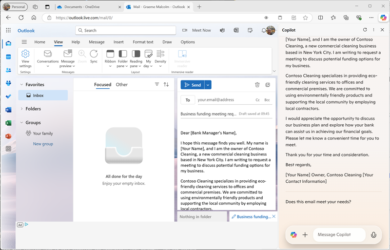

---
lab:
  title: Menjelajahi Copilot di Microsoft Edge
---
# Menjelajahi Microsoft Copilot di Microsoft Edge

Dalam latihan ini Anda akan menjelajahi beberapa cara di mana Microsoft Copilot dapat menggunakan AI generatif untuk membantu Anda menjadi lebih produktif saat membuat konten baru. Dalam skenario untuk latihan ini, Anda akan memulai dengan beberapa catatan tingkat tinggi untuk ide bisnis, dan menggunakan Copilot di Microsoft Edge untuk membantu Anda mengembangkan rencana bisnis dan presentasi untuk calon investor.

Latihan ini akan memakan waktu sekitar **40** menit untuk diselesaikan.

> **Catatan**: Latihan ini mengasumsikan bahwa Anda memiliki [Akun](https://signup.live.com) Microsoft pribadi (seperti akun outlook.com) tempat Anda masuk ke [Microsoft Edge](https://www.microsoft.com/edge/download) di komputer Anda.

## Menggunakan Copilot untuk menjelajahi dokumen dan meneliti ide

Untuk memulai eksplorasi AI generatif Anda, mari kita gunakan Microsoft Copilot di Edge untuk memeriksa dokumen yang ada dan mengekstrak beberapa wawasan darinya.

1. Di Microsoft Edge, telusuri ke [OneDrive](https://onedrive.live.com) di `https://onedrive.live.com` dan masuk menggunakan akun Microsoft pribadi Anda - menutup pesan atau penawaran selamat datang yang ditampilkan.
1. Di tab browser lain, buka dokumen [Business Idea.docx](https://github.com/MicrosoftLearning/mslearn-ai-fundamentals/raw/main/data/generative-ai/Business%20Idea.docx) dari `https://github.com/MicrosoftLearning/mslearn-ai-fundamentals/raw/main/data/generative-ai/Business%20Idea.docx`. Kemudian, saat dokumen terbuka di Edge, pilih opsi untuk **Menyimpan salinan ke OneDrive** dan menyimpan dokumen di folder Dokumen** Anda **di OneDrive. Dokumen kemudian harus terbuka di Microsoft Word online secara otomatis.

    > **Tips**: Jika Anda tidak melihat opsi untuk menyimpan salinan file ke OneDrive, unduh ke komputer lokal Anda. Lalu, di OneDrive, buka **folder Dokumen** dan gunakan **tombol + Tambahkan baru** untuk mengunggah **file Business Idea.docx** dari komputer lokal Anda ke OneDrive.

1. Lihat teks di **Idea.docx** Bisnis, yang menjelaskan beberapa ide tingkat tinggi untuk bisnis pembersihan di New York City.
1. Gunakan ikon Copilot** pada toolbar Edge untuk membuka panel Copilot, seperti yang **diperlihatkan di sini:

    

1. Di panel Copilot, gulir ke bawah untuk melihat semua konten seperlunya, dan pastikan bahwa **tab Obrolan** dipilih dan bahwa gaya percakapan diatur ke **Lebih Seimbang** - ini akan memastikan bahwa Copilot merespons dengan keseimbangan kreativitas dan presisi faktual.
1. Dalam kotak obrolan di bagian bawah panel Salinan, masukkan perintah berikut:

    ```
    What is this document about?
    ```

    Jika diminta, konfirmasikan bahwa Anda ingin mengizinkan Copilot mengakses halaman.

1. Tinjau respons dari Copilot, yang harus meringkas poin utama dalam dokumen, seperti yang ditunjukkan di sini:

    

    > **Catatan**: Respons spesifik dapat bervariasi.

1. Masukkan perintah berikut:

    ```
    How do I go about setting up a business in New York?
    ```

1. Tinjau respons, yang harus berisi beberapa saran dan tautan ke sumber daya untuk membantu Anda mulai menyiapkan bisnis di New York, dan mungkin menyertakan beberapa permintaan tindak lanjut yang disarankan untuk mendapatkan informasi selengkapnya.

    > **Penting**: Respons yang dihasilkan AI didasarkan pada informasi secara publik di Web. Meskipun mungkin berguna untuk membantu Anda memahami langkah-langkah yang diperlukan untuk menyiapkan bisnis, itu tidak dijamin 100% akurat dan tidak menggantikan kebutuhan akan saran profesional!

## Menggunakan Copilot untuk membuat konten untuk paket bisnis

Sekarang setelah Anda melakukan beberapa penelitian awal, mari kita minta Copilot membantu Anda mengembangkan rencana bisnis untuk perusahaan kebersihan Anda.

1. **Dengan dokumen Business Idea.docx** masih terbuka di Microsoft Edge, di panel Copilot, masukkan perintah berikut:

    ```
    Suggest a name for my cleaning business
    ```

1. Tinjau saran dan pilih nama untuk perusahaan pembersih Anda (atau lanjutkan meminta untuk menemukan nama yang Anda suka).
1. Masukkan perintah berikut, ganti *Contoso Cleaning* dengan nama perusahaan pilihan Anda:

    ```
    Write a business plan for "Contoso Cleaning" based on the information in this document. Include an executive summary, market overview, and financial projections.
    ```

1. Tinjau respons, dan di bawah output gunakan **ikon Salin** (&#128461;) untuk menyalinnya ke clipboard. Kemudian pilih semua teks dalam **dokumen Ideas.docx** Bisnis dan tempelkan teks yang disalin ke dalam dokumen untuk menggantinya. Terakhir, rapikan teks yang ditempelkan dengan mengganti teks awal dalam respons (di mana Copilot mengakui instruksi) dengan judul untuk nama perusahaan pembersih Anda. Anda harus berakhir dengan dokumen paket bisnis, mirip dengan ini:

    

1. Di panel Copilot, masukkan perintah berikut ini:

    ```
    Create a corporate logo for the cleaning company. The logo should be round and include an iconic New York landmark.
    ```

1. Tinjau respons, yang harus menyajikan empat opsi untuk logo yang dibuat oleh Microsoft Designer.
1. Gunakan lebih banyak perintah untuk melakukan iterasi pada desain (misalnya, `Make it green and blue`) sampai Anda memiliki logo yang Anda senangi.
1. Klik kanan desain logo yang Anda sukai dan salin ke clipboard. Kemudian tempelkan ke bagian atas dokumen paket bisnis, seperti ini:

    

1. Tutup tab Microsoft Word dan kembali ke **folder Dokumen** di OneDrive Anda.

## Menggunakan Copilot untuk membuat konten untuk presentasi

Dengan bantuan Copilot, Anda telah membuat draf rencana bisnis untuk ide bisnis pembersihan. Sekarang Anda akan membutuhkan presentasi yang efektif untuk meyakinkan investor untuk meminjamkan Anda pendanaan untuk memulai bisnis.

1. **Di folder Dokumen** di OneDrive, tambahkan presentasi** PowerPoint baru**.

    Jika panel Perancang **** terbuka secara otomatis, tutup.

1. Pada slide judul untuk presentasi, masukkan nama perusahaan pembersih Anda sebagai judul, dan `Investor Opportunity` sebagai subtitel.
1. Tambahkan slide baru, menggunakan **tata letak slide Dua Konten** (yang menyertakan judul dan dua tempat penampung untuk konten).
1. Ubah judul slide menjadi `Benefits of Hiring a Commercial Cleaner`.
1. Di panel Copilot, masukkan perintah berikut ini:

    ```
    Write a summary of the benefits of using a corporate cleaning company for your business. The summary should consist of five short bullet points.
    ```

1. Salin respons Copilot ke clipboard, dan tempelkan ke tempat penampung konten kiri. Kemudian hapus kalimat awal yang mengakui permintaan dan memformat ulang teks di tempat penampung sampai Anda puas.
1. Di panel Copilot, masukkan perintah berikut ini:

    ```
    Create a photorealistic image of a clean office.
    ```

1. Ketika Copilot telah menghasilkan gambar yang Anda suka, salin ke clipboard dan tempelkan ke tempat penampung konten di sebelah kanan slide.

    Jika panel Perancang **** terbuka secara otomatis, pilih desain slide yang Anda suka. Lalu tutup panel Perancang****.

1. Terapkan pemformatan ulang tambahan yang menurut Anda diperlukan hingga Anda memiliki slide yang terlihat mirip dengan ini:

    

1. Pada bilah judul PowerPoint, pilih nama presentasi default (**Presentasi**) dan ganti namanya menjadi `Business Presentation.pptx`.
1. Tutup tab PowerPoint dan kembali ke **folder Dokumen** di OneDrive Anda.

## Menggunakan Copilot untuk membuat email

Anda telah membuat beberapa jaminan untuk membantu Anda memulai bisnis Anda. Sekarang saatnya untuk menjangkau investor yang mencari beberapa pendanaan startup.

1. **Gunakan Peluncur** Aplikasi di ujung kiri bilah judul OneDrive untuk membuka **Outlook**.
1. Buat email baru, dan isi kotak **Kepada** dengan alamat email Anda sendiri.
1. Di panel Salinan, pilih tab **Buat** . Kemudian atur opsi berikut untuk membuat konten baru:
    - **Tulis tentang**: `Request a meeting with an investment bank to discuss funding for a commercial cleaning business.`
    - **Nada**: Profesional
    - **Format**: Email
    - **Panjang**: Sedang
1. Pilih **Buat draf**, dan tinjau output yang dihasilkan.
1. Gunakan konten yang dihasilkan untuk menyelesaikan email Anda, seperti yang ditunjukkan di sini:

    

    Anda dapat mengirim email ke diri Anda sendiri jika Anda mau!

## Latihan

Sekarang Anda telah melihat cara menggunakan Copilot untuk meneliti ide dan menghasilkan konten, mengapa tidak mencoba menjelajahi lebih lanjut? Untuk memulai sesi Copilot baru, pada tab **Obrolan** , pilih **ikon Topik** baru di samping kotak perintah, lalu coba gunakan Copilot untuk merencanakan acara untuk mempromosikan literasi anak-anak di pustaka lokal. Beberapa hal yang dapat Anda coba meliputi:

- Teliti beberapa tips untuk mendorong anak membaca pada usia dini.
- Buat selebaran atau poster untuk acara tersebut.
- Buat email untuk kampanye guna mengundang penulis anak-anak lokal untuk datang dan berbicara di acara tersebut.
- Buat presentasi untuk memulai acara.

Jadilah inventif seperti yang Anda suka, dan jelajahi bagaimana Copilot dapat membantu Anda dengan menemukan informasi, menghasilkan dan menyempurnakan teks, membuat gambar, dan menjawab pertanyaan.


## Kesimpulan

Dalam latihan ini, Anda telah menggunakan Copilot di Microsoft Edge untuk menemukan informasi dan menghasilkan konten. Semoga Anda telah melihat bagaimana menggunakan AI generatif dalam salinan dapat membantu produktivitas dan kreativitas.

Meskipun layanan gratis yang digunakan dalam latihan ini tidak diragukan lagi sangat kuat, Anda dapat mencapai lebih banyak hal dengan layanan seperti [Copilot untuk Microsoft 365](https://www.microsoft.com/microsoft-365/enterprise/copilot-for-microsoft-365), di mana Microsoft Copilot diintegrasikan ke dalam aplikasi produktivitas Windows dan Microsoft Office, memberikan bantuan yang sangat kontekstual dengan tugas umum. Microsoft 365 memungkinkan Anda menghadirkan kekuatan AI generatif ke data dan proses bisnis Anda, sambil mengintegrasikan ke dalam infrastruktur TI yang ada untuk memastikan solusi yang dapat dikelola dan aman.