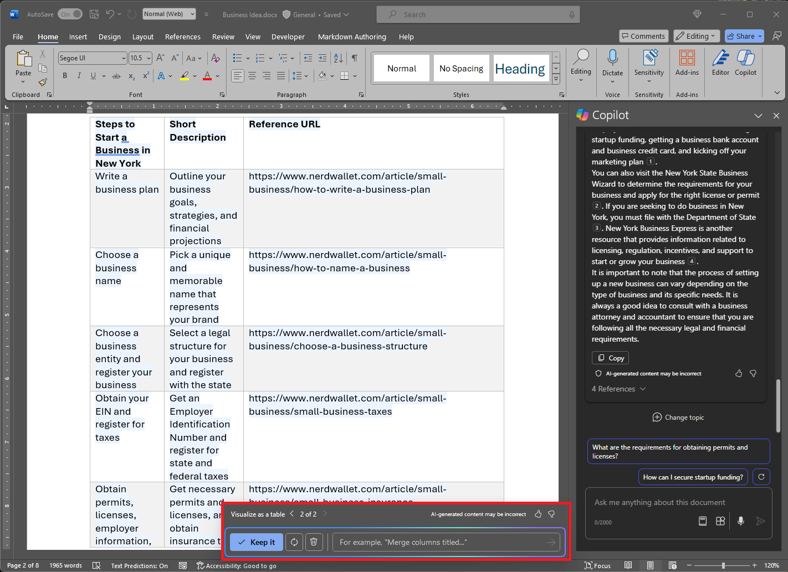
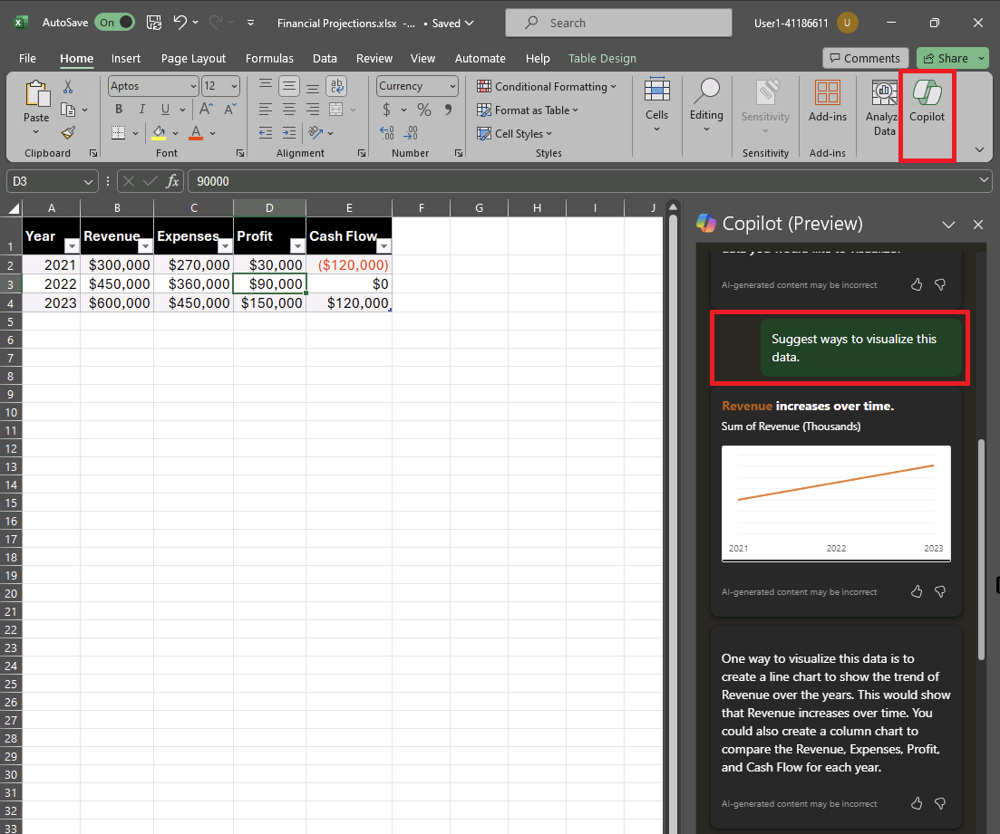
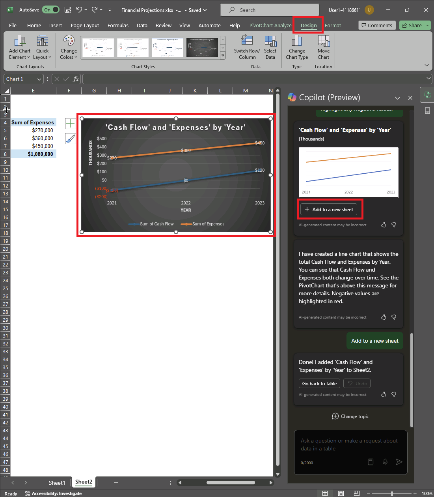

---
lab:
  title: Jelajahi Copilot untuk Microsoft 365
---
# Jelajahi Copilot untuk Microsoft 365

Dalam latihan ini Anda akan menjelajahi beberapa cara di mana Microsoft Copilot dapat menggunakan AI generatif untuk membantu Anda menjadi lebih produktif saat membuat konten baru. Dalam skenario untuk latihan ini, Anda akan memulai dengan beberapa catatan tingkat tinggi untuk ide bisnis, dan menggunakan Copilot untuk Microsoft 365 di beberapa aplikasi seperti Word, PowerPoint, dan Excel untuk membantu Anda mengembangkan rencana bisnis dan presentasi untuk calon investor.

Latihan ini akan memakan waktu sekitar **40** menit untuk diselesaikan.

> **Catatan**: Latihan ini memerlukan **lisensi Copilot untuk Microsoft 365** dari organisasi Anda.

## Menggunakan Copilot untuk menjelajahi dokumen dan meneliti ide

Untuk memulai eksplorasi AI generatif Anda, mari kita gunakan Copilot for Word untuk memeriksa dokumen yang ada dan mengekstrak beberapa wawasan darinya.

1. Di browser web Anda, buka dokumen [Idea.docx](https://github.com/MicrosoftLearning/mslearn-ai-fundamentals/raw/main/data/generative-ai/Business%20Idea.docx) Bisnis di `https://github.com/MicrosoftLearning/mslearn-ai-fundamentals/raw/main/data/generative-ai/Business%20Idea.docx`. 
1. Pilih **Unduh** untuk menyimpan file ke folder Unduhan** PC **Anda.
1. **Pindahkan** atau **Salin & Tempel** dokumen yang baru saja Anda unduh ke **folder OneDrive** .
1. Dari folder OneDrive** Anda**, buka **Business Idea.docx** di Microsoft Word (menutup pesan selamat datang atau pemberitahuan fitur baru) dan tinjau dokumen, yang menjelaskan beberapa ide tingkat tinggi untuk bisnis pembersihan di New York City. Jika diminta, pilih **Aktifkan pengeditan** di bagian atas.
1. Temukan dan pilih **ikon Copilot** pada toolbar Word untuk membuka panel Copilot, seperti yang diperlihatkan di sini (tema visual Anda mungkin bervariasi):

    

1. Di panel Copilot, masukkan perintah berikut ini di area teks di bagian bawah:

    ```
    What is this document about?
    ```

1. Tinjau respons dari Copilot, yang harus meringkas poin utama dalam dokumen, seperti yang ditunjukkan di sini:

    

    > Respons spesifik yang Anda terima dapat bervariasi karena sifat AI generatif.

1. Kembali ke panel Copilot untuk mengajukan pertanyaan berikut kepada Copilot:

    ```
    How do I setup a new business in New York?
    ```

1. Tinjau respons dan tindak lanjuti dengan pertanyaan tambahan sesuai kebutuhan. Saat Anda puas dengan respons, gunakan **ikon Salin** (&#128461;) di bawah respons untuk menyalinnya ke clipboard. Tempelkan ke dokumen Word, pilih semua teks lalu pilih ikon Salinan untuk memvisualisasikan teks sebagai tabel.

    

1. Tinjau tabel dan minta Copilot untuk menambahkan informasi selengkapnya, seperti referensi untuk detail selengkapnya.  Respons Anda akan terlihat seperti ini (Anda mungkin perlu menggunakan tombol **Regenerasi** ):

    

    > **Penting**: Respons yang dihasilkan AI didasarkan pada informasi secara publik di Web. Meskipun mungkin berguna untuk membantu Anda memahami langkah-langkah yang diperlukan untuk menyiapkan bisnis, itu tidak dijamin 100% akurat dan tidak menggantikan kebutuhan akan saran profesional!

1. Saat Anda puas dengan tabel yang telah dihasilkan Copilot, pilih opsi untuk **Menyimpannya**.

## Menggunakan Copilot untuk membuat konten untuk paket bisnis

Sekarang setelah Anda melakukan beberapa penelitian awal, mari kita minta Copilot membantu Anda mengembangkan rencana bisnis untuk perusahaan kebersihan Anda.

1. **Dengan dokumen Idea.docx** Bisnis masih terbuka, di panel Salinan, masukkan perintah berikut:

    ```
    Can you suggest a name for my cleaning business?
    ```

1. Tinjau saran dan pilih nama untuk perusahaan pembersih Anda (atau lanjutkan meminta untuk menemukan nama yang Anda suka).
1. Di dokumen Word, pilih ikon Salinan di margin untuk membuat draf konten baru. Masukkan perintah berikut, ganti **Contoso Cleaning** dengan nama perusahaan pilihan Anda:

    ```
    Write a business plan for "Contoso Cleaning" based on the information in this document. Include an executive summary, market overview, and financial projections.
    ```

    

1. Tinjau respons yang disusur oleh Copilot dan simpan, sesuaikan nada, panjang, atau minta Copilot untuk menulis ulang dengan prompt baru. Terapkan judul dan gaya yang sesuai ke dokumen Anda agar terlihat profesional. Respons Anda akan terlihat seperti ini:

    

1. Jika proyeksi keuangan dalam paket bisnis tidak diformat sebagai tabel, pilih dan gunakan Copilot untuk memvisualisasikan proyeksi sebagai tabel.
1. Pilih tabel proyeksi keuangan dan salin ke clipboard.
1. Simpan dokumen Word.

## Memvisualisasikan proyeksi keuangan dalam Salinan untuk Excel

Dengan rencana bisnis di tangan, mari kita ambil beberapa data tersebut tentang proyeksi keuangan dan minta Copilot di Excel untuk memvisualisasikan data itu untuk kita, sehingga kita dapat menyertakannya dalam email atau presentasi kepada investor.

1. Di PC Anda dengan aplikasi Microsoft 365 terinstal, buka **Excel** dan buat buku kerja kosong baru. Segera simpan buku kerja sebagai **Projetions.xlsx** Keuangan ke OneDrive, atau Copilot tidak akan berfungsi.
1. Tempelkan tabel proyeksi penjualan dari **Idea.docx** Bisnis ke lembar bentang Excel dan **format sebagai tabel**. Untuk melakukan ini:
    1. **Pilih sel** dalam data Anda.
    1. Pilih **Beranda** dan pilih **Format sebagai Tabel** di bawah Gaya. 
    1. Pilih gaya untuk tabel Anda.
    1. Dalam kotak **dialog Buat Tabel** , konfirmasi atau atur rentang sel Anda.
    1. Tandai jika tabel Anda memiliki header, dan pilih **OK**.
1. Dengan proyeksi penjualan Anda yang diformat sebagai tabel, buka panel Copilot dari pita Excel dan masukkan perintah berikut:

    ```
    Suggest ways to visualize these financial projections.
    ```
    
1. Copilot harus menyarankan 1 atau 2 cara untuk memvisualisasikan data Anda dan menawarkan untuk menambahkan bagan pivot ke lembar baru.

    

1. Namun, Anda mungkin ingin melihat lebih banyak data dalam bagan untuk memperlihatkan perubahan tahun ke tahun, jadi masukkan perintah berikut untuk menambahkan lebih banyak:

    ```
    Visualize these financial projections in a line chart to show year-over-year revenue and profits.
    ```

    

1. Tambahkan bagan pivot ke lembar baru dan buka. Pilih bagan lalu pilih **Desain** untuk menerapkan gaya, ubah tipe bagan dan tindakan lainnya. Pada akhirnya, Anda harus memiliki sesuatu yang menyerupan ini:

    

1. Simpan file ke OneDrive dan tutup Excel.

Anda baru saja menggunakan data yang dibuat dari Copilot di Word untuk memvisualisasikannya di Excel. Dalam latihan berikutnya, Anda akan melanjutkan menggunakan Copilot di Outlook untuk menyusun dan mengirim email tentang pekerjaan yang telah Anda lakukan.

## Menggunakan Copilot untuk membuat email

Anda telah membuat beberapa jaminan untuk membantu Anda memulai bisnis Anda. Sekarang saatnya untuk menjangkau investor yang mencari beberapa pendanaan startup.

1. Di PC Anda dengan aplikasi Microsoft 365 terinstal, buka **Outlook**. Jika Anda belum menyiapkan Outlook dengan akun Microsoft 365 Anda, lihat [Menyiapkan dan menggunakan Outlook - Dukungan](https://support.microsoft.com/office/set-up-and-use-outlook-4636f361-d5e3-4a87-9cd4-382858de55fa) Microsoft.
1. Aktifkan **pengalaman Outlook** baru. Untuk mendapatkan fitur Copilot terbaru di Outlook, Anda harus menggunakan pengalaman "New Outlook". Untuk melihat versi mana yang Anda gunakan, lihat [Versi Outlook apa yang saya miliki? - Dukungan](https://support.microsoft.com/office/what-version-of-outlook-do-i-have-b3a9568c-edb5-42b9-9825-d48d82b2257c) Microsoft.
1. Buat email baru, dan isi kotak **Kepada** dengan alamat email Anda sendiri.
1. Anda bisa mulai membuat draf email dari panel Copilot atau langsung dari dalam isi email:

    
    
1. Masukkan perintah berikut dan sesuaikan nada menjadi "Formal" dan panjangnya menjadi "Sedang":

    ```
    Request a meeting with an investment bank to discuss funding for a commercial cleaning business.
    ```

    

1. Pilih **Buat draf**, dan tinjau output yang dihasilkan. Sesuaikan nada atau beri tahu Copilot apa yang ingin Anda ubah tentang email tersebut.

    

1. Anda dapat mengirim email ke diri Anda sendiri jika Anda mau!

## Menggunakan Copilot untuk membuat konten untuk presentasi

Dengan bantuan Copilot, Anda telah membuat draf rencana bisnis untuk ide bisnis pembersihan, menyiapkan beberapa proyeksi keuangan, dan mengirim email untuk meminta pertemuan dengan calon investor. Sekarang Anda akan memerlukan presentasi yang efektif untuk mengomunikasikan manfaat bisnis Anda.

1. Buka **PowerPoint** dan buat presentasi** kosong baru**. Jika panel Perancang **** terbuka secara otomatis, tutup.

    

1. Simpan presentasi sebagai **Membersihkan Company.pptx** di folder OneDrive Anda.
1. Pilih tombol **** Copilot di tab **** Beranda pita, pilih **Buat presentasi tentang...**, lalu selesaikan perintah di panel Copilot sebagai berikut:

    ```
    Create a presentation about a corporate cleaning service in New York City.
    ```

1. Salinan akan menghasilkan slide dalam presentasi.  Prosesnya mungkin memakan waktu beberapa menit dan output Anda akan terlihat seperti ini dengan tema yang berbeda:

    

1. Pilih slide terakhir kedua dalam presentasi. Kemudian, di panel Copilot, minta untuk menambahkan slide baru menggunakan perintah ini:

    ```
    Add a slide that describes the benefits of an eco-friendly approach to cleaning. 
    ```

    

1. Simpan presentasi.

## Latihan

Sekarang Anda telah melihat cara menggunakan Copilot untuk Microsoft 365 dalam beberapa aplikasi berbeda untuk meneliti ide dan menghasilkan konten, mengapa tidak mencoba menjelajahi lebih lanjut? Coba gunakan Copilot untuk merencanakan acara untuk mempromosikan literasi anak-anak di perpustakaan lokal. Beberapa hal yang dapat Anda coba meliputi:

- Teliti beberapa tips untuk mendorong anak membaca pada usia dini.
- Buat selebaran atau poster untuk acara tersebut.
- Buat email untuk kampanye guna mengundang penulis anak-anak lokal untuk datang dan berbicara di acara tersebut.
- Buat presentasi untuk memulai acara.

Jadilah inventif seperti yang Anda suka, dan jelajahi bagaimana Copilot dapat membantu Anda dengan menemukan informasi, menghasilkan dan menyempurnakan teks, membuat gambar, dan menjawab pertanyaan.

## Kesimpulan

Dalam latihan ini, Anda telah menggunakan [Copilot untuk Microsoft 365](https://www.microsoft.com/microsoft-365/enterprise/copilot-for-microsoft-365) untuk menemukan informasi dan menghasilkan konten. Semoga Anda telah melihat bagaimana menggunakan AI generatif dalam salinan dapat membantu produktivitas dan kreativitas. Microsoft 365 memungkinkan Anda menghadirkan kekuatan AI generatif ke data dan proses bisnis Anda, sambil mengintegrasikan ke dalam infrastruktur TI yang ada untuk memastikan solusi yang dapat dikelola dan aman.
