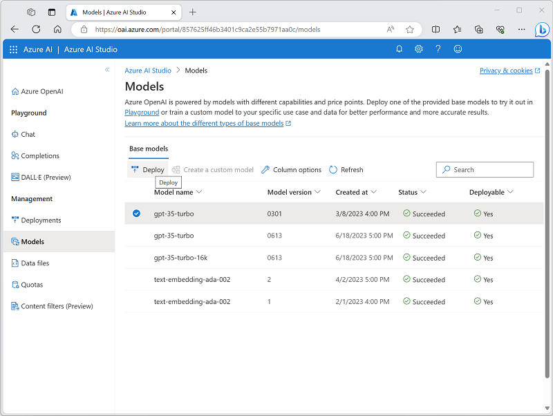

---
lab:
  title: Menjelajahi Layanan Azure OpenAI
---

# Menjelajahi Azure OpenAI

Azure OpenAI Service menghadirkan model AI generatif yang dikembangkan oleh OpenAI ke platform Azure, memungkinkan Anda mengembangkan solusi AI canggih yang mendapat manfaat dari keamanan, skalabilitas, dan integrasi layanan yang disediakan oleh platform cloud Azure.

Dalam latihan ini, Anda akan menjelajahi Azure OpenAI Service dan menggunakannya untuk menyebarkan dan bereksperimen dengan model AI generatif.

Latihan ini akan memakan waktu sekitar **25** menit.

## Sebelum memulai

Anda akan memerlukan langganan Azure yang telah disetujui untuk akses ke layanan Azure OpenAI untuk model teks dan kode, dan model pembuatan gambar DALL-E.

- Untuk mendaftar langganan Azure gratis, kunjungi [https://azure.microsoft.com/free](https://azure.microsoft.com/free).
- Untuk meminta akses ke layanan Azure OpenAI, kunjungi [https://aka.ms/oaiapply](https://aka.ms/oaiapply).

## Memprovisikan sumber daya Azure OpenAI

Sebelum dapat menggunakan model Azure OpenAI, Anda harus memprovisikan sumber daya Azure OpenAI di langganan Azure Anda.

1. Masuk ke [Portal Microsoft Azure](https://portal.azure.com).
2. Buat **sumber daya Azure OpenAI** dengan pengaturan berikut:
    - **Langganan**: *Langganan Azure yang telah disetujui untuk akses ke layanan Azure OpenAI.*
    - **Grup** sumber daya: *Pilih grup sumber daya yang sudah ada atau buat grup sumber daya baru dengan nama pilihan Anda.*
    - **Wilayah**: *Pilih wilayah yang tersedia*.
    - **Nama**: *Nama unik pilihan Anda.*
    - **Tingkat harga**: Standar S0
3. Tunggu hingga penerapan selesai. Kemudian buka sumber daya Azure OpenAI yang disebarkan di portal Azure.

## Menjelajahi Azure OpenAI Studio

Anda dapat menyebarkan, mengelola, dan menjelajahi model di Azure OpenAI Service Anda dengan menggunakan Azure OpenAI Studio.

1. Pada halaman **Gambaran Umum** untuk sumber daya Azure OpenAI Anda, gunakan **tombol Jelajahi** untuk membuka Azure OpenAI Studio di tab browser baru. Atau, navigasikan ke [Azure OpenAI Studio](https://oai.azure.com/) secara langsung.

    Saat Anda pertama kali membuka Azure OpenAI Studio, azure OpenAI Studio akan terlihat mirip dengan ini:

    

1. Tampilkan halaman yang tersedia di panel di sebelah kiri. Anda selalu dapat kembali ke halaman beranda di bagian atas. Selain itu, OpenAI Studio menyediakan beberapa halaman di mana Anda dapat:
    - Bereksperimenlah dengan model di *taman* bermain.
    - Mengelola penyebaran dan data model.

## Menyebarkan model untuk pembuatan bahasa

Untuk bereksperimen dengan pembuatan bahasa alami, Anda harus terlebih dahulu menyebarkan model.

1. Pada halaman **Model** , lihat model yang tersedia di instans layanan Azure OpenAI Anda.
1. Pilih salah **satu model gpt-35-turbo** yang **statusnya Dapat Disebarkan** adalah **Ya**, lalu pilih **Sebarkan**:

    

1. Buat penyebaran baru dengan pengaturan berikut:
    - **Model**: gpt-35-turbo
    - **Versi model**: Pembaruan otomatis ke default
    - **Nama** penyebaran: *Nama unik untuk penyebaran model Anda*

## *Menggunakan taman bermain Obrolan* untuk bekerja dengan model

Setelah menyebarkan model, Anda dapat menggunakannya di *taman bermain Obrolan* untuk menghasilkan output bahasa alami dari perintah yang Anda kirimkan di antarmuka obrolan.

1. Di [Azure OpenAI Studio](https://oai.azure.com/), navigasikan **ke playground Obrolan** di panel kiri.

    *Taman bermain Obrolan* menyediakan antarmuka chatbot tempat Anda dapat berinteraksi dengan model yang disebarkan, seperti yang ditunjukkan di sini:

    

1. Di panel **Konfigurasi** , pastikan bahwa penyebaran model Anda dipilih.
1. Di panel **Penyetelan** asisten, pilih **templat pesan sistem Default** , dan lihat pesan sistem yang dibuat templat ini. Pesan sistem mendefinisikan bagaimana model akan bertingkah laku dalam sesi obrolan Anda.
1. Di bagian **Sesi** obrolan, masukkan pesan pengguna berikut ini.

    ```
   What is generative AI?
    ```

1. Amati output yang dikembalikan oleh model, yang harus memberikan definisi AI generatif.
1. Masukkan pesan pengguna berikut sebagai pertanyaan tindak lanjut:

    ```
   What are three benefits it provides?
    ```

1. Tinjau output, mencatat bahwa sesi obrolan telah melacak input dan respons sebelumnya untuk memberikan konteks (sehingga menafsirkan "itu" dengan benar sebagaimana merujuk pada "AI generatif") dan bahwa sesi tersebut memberikan respons yang sesuai berdasarkan apa yang diminta (harus mengembalikan tiga manfaat AI generatif).

## *Menggunakan taman bermain DALL-E* untuk menghasilkan gambar

Selain model pembuatan bahasa, Azure OpenAI Service mendukung model DALL-E 2 untuk pembuatan gambar.

> **Catatan**: Anda harus telah menerapkan dan menerima akses ke fungsionalitas DALL-E di aplikasi akses layanan Azure OpenAI Anda untuk menyelesaikan bagian latihan ini.

1. Di [Azure OpenAI Studio](https://oai.azure.com/), navigasikan **ke taman bermain DALL-E** di panel kiri.
1. Masukkan perintah berikut:

    ```
    A robot eating spaghetti
    ```

1. Pilih **Hasilkan** dan lihat hasilnya, yang harus terdiri dari gambar berdasarkan deskripsi yang Anda berikan dalam perintah, mirip dengan ini:

    

1. Hasilkan gambar kedua dengan memodifikasi perintah ke:

    ```
    A robot eating spaghetti in the style of Rembrandt
    ```
1. Verifikasi bahwa gambar baru cocok dengan persyaratan permintaan, mirip dengan ini:

    

## Penghapusan

Setelah selesai dengan sumber daya Azure OpenAI, ingatlah untuk menghapus penyebaran atau seluruh sumber daya di [portal Azure](https://portal.azure.com/?azure-portal=true).
